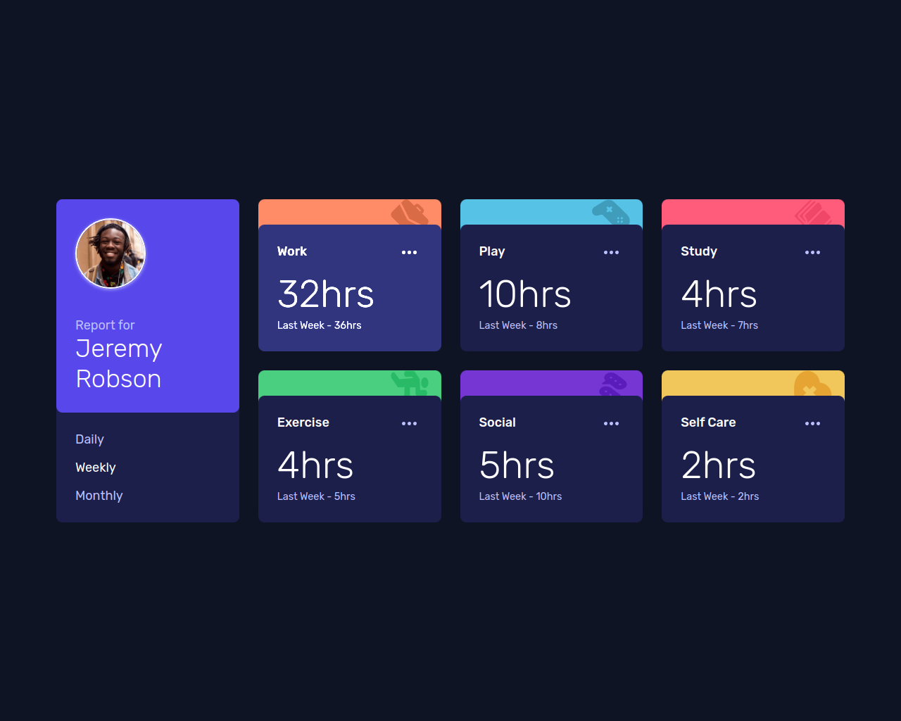
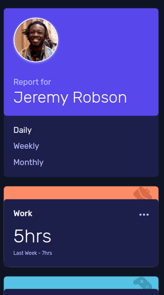

# Frontend Mentor - Time tracking dashboard solution

This is a solution to the [Time tracking dashboard challenge on Frontend Mentor](https://github.com/thiagoa-martins/timeTrackingDashboard). Frontend Mentor challenges help you improve your coding skills by building realistic projects. 

# Time tracking dashboard solution

- O projeto foi desenvolvido com ReactJS, JavaScript e Styled-components.

## Índice

- [Visão Geral](#visao-geral)
  - [Screenshot](#screenshot)
  - [Links](#links)
  - [Como rodar o projeto](#como-rodar-o-projeto)
- [Autor](#autor)

## Visao Geral

### Screenshot

### Links

- URL do repositório: [Código](https://github.com/thiagoa-martins/timeTrackingDashboard)

### Como rodar o projeto

- Acesse o site: [Site](https://time-tracking-dashboard-thiagoa-martins.vercel.app/)

#### Caso queira rodar na máquina

- `npm i` para instalar as dependências
- `npm start` para rodar o projeto
- Acesse a url disponibilizada

## Autor

- Github - [thiagoa-martins](https://github.com/thiagoa-martins)
- Linkedin - [thiagoa-martins](https://www.linkedin.com/in/thiagoa-martins/)
